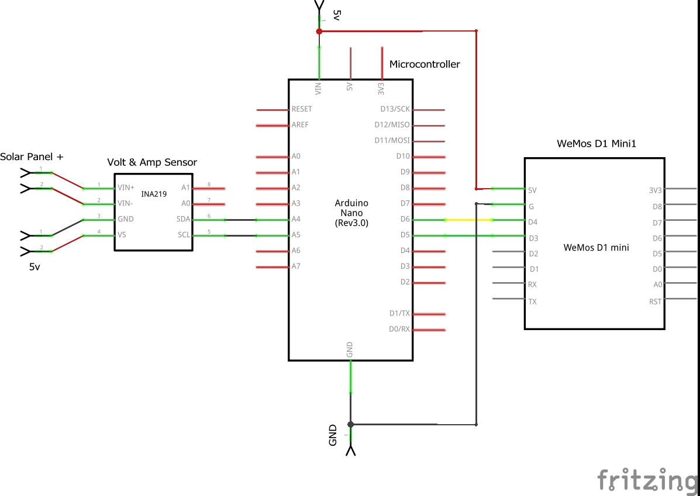
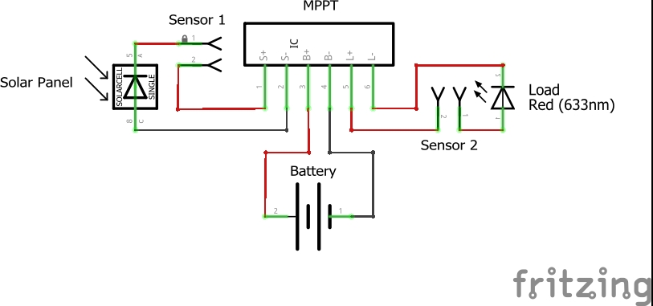

# Monitoring Panel Surya

Project pertama praktikum sensor aktuator yaitu memonitoring arus dan tegangan yang di hasilkan oleh panel surya serta yang terpakai dari battery.

## Pre-request

### Basic Knowledge
- [x] Web Programming
- [x] Arduino
- [x] Elektrical

### Tools
- [x] [NodeJS](https://nodejs.org/en/download/) `Server-side Javascript runtime environment`
- [x] [Google Chrome](https://www.google.com/chrome/) `Web Browser`
- [x] [Visual Studio Code](https://code.visualstudio.com/) `Text Editor`

## Scheme

### Monitor System Circuit

### Power System Circuit

